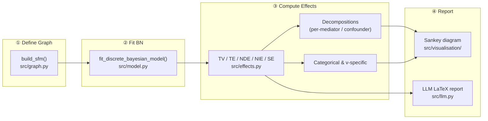

# FAIRMIND

[](https://www.python.org/)
[](LICENSE)
[](https://github.com/astral-sh/ruff)

## Abstract

Auditing algorithmic systems for discrimination requires decomposing an observed disparity into its causal constituents: how much stems from a *direct* effect of the sensitive attribute, how much is transmitted *indirectly* through mediators, and how much reflects *spurious* confounding?

This library provides a partial Python implementation of the **causal fairness analysis** framework of Plečko & Bareinboim (2024), covering the complete Total Variation family of path-specific effects — TV, TE, NDE, NIE, SE — together with their per-mediator and per-confounder decompositions (Theorems 6.6 & 5.7). Inference is performed analytically on fitted **discrete Bayesian networks** (via `pgmpy`) An **LLM-interpretative layer** (OpenAI Responses API) translates the numerical results into plain-language + LaTeX audit reports, following the *LLM as Data Scientist* paradigm.

---

## 🌟 Key Features

- **Total Variation family** — exact identification of TV, TE, NDE, NIE, SE under Markovian and semi-Markovian Standard Fairness Models (SFMs).
- **Categorical / multi-state variants** — sweep over all ordered pairs of sensitive-attribute states; detect sign reversals (Simpson-style reversals on ordinal scales).
- **Effect decompositions**
  - Per-mediator indirect-effect decomposition (Thm. 6.6)
  - Per-confounder spurious-effect decomposition — Markovian models (Thm. 5.7)
- **Utility-weighted effects** — integrate a utility function T(V) over target states to produce a single scalar disparity under arbitrary ordinal scales.
- **Discrete Bayesian Network fitting** — wraps `pgmpy` with type-annotated SFM graphs; Dirichlet / MLE estimators supported.
- **Visualisations** — Sankey TV→{TE, SE}→{NDE, NIE} decomposition diagrams (Plotly); SFM graph plots (`daft-pgm`).
- **LLM audit reports** — structured LaTeX + plain-text reports via the OpenAI Responses API.

### To-implement
- **V-specific effects** — conditional (subgroup-specific) variants: v-TE, v-DE, v-IE, v-SE.

---

## 🔄 Pipeline Architecture

The core workflow is a three-stage pipeline: **define a graph → fit a Bayesian network → compute and report effects**.



---

## 📐 Implemented Theorems & Identification Formulas

All identification formulas are evaluated analytically using `pgmpy`'s `VariableElimination` and `CausalInference` backends on the fitted Bayesian network.

| Function | Effect | Definition / Theorem |
|---|---|---|
| `total_variation` | $TV(x_0, x_1, y)$ | $P(Y=y \| X=x_1) − P(Y=y \| X=x_0)$ |
| `total_effect` | $TE(x_0, x_1, y)$ | $P(Y_{x_1}=y) − P(Y_{x_0}=y)$, adjusted for confounders |
| `spurious_effect` | $SE(x, y)$ | $P(Y=y \| X=x) − P(Y_{x}=y)$ |
| `natural_direct_effect` | $NDE(x_0, x_1, y)$ | $P(Y_{x_1, W_{x_0}}=y) − P(Y_{x_0}=y)$ |
| `natural_indirect_effect` | $NIE(x_0, x_1, y)$ | $P(Y_{x_0, W_{x_1}}=y) − P(Y_{x_0}=y)$ |
| `decompose_indirect_effect` | Per-mediator NIE | Path-specific attribution — Thm. 6.6 |
| `decompose_spurious_effect` | Per-confounder SE | Markovian models — Thm. 5.7 |
| `categorical_*` variants | Multi-state sweeps | Def. 6.6; sign-reversal detection |
| `utility_weighted_effect` | E[T(Y)] disparity | Utility-weighted expectation over target states |


<!-- | `v_specific_total_effect` | v-TE | TE conditioned on V=v — Def. 6.3 | -->
<!-- | `v_specific_natural_direct_effect` | v-DE | NDE conditioned on V=v — Def. 6.3 | -->
<!-- | `v_specific_natural_indirect_effect` | v-IE | NIE conditioned on V=v — Def. 6.3 | -->
---

## 📂 Repository Structure

```text
├── src/                # Core library source code
│   ├── visualisation/  # Graph and Sankey visualisation utilities
│   ├── effects.py      # Causal effect estimation and decomposition
│   ├── graph.py        # Standard Fairness Model (SFM) builder
│   ├── model.py        # Bayesian Network fitting logic
│   └── llm.py          # LLM integration for automated audit reports
├── notebooks/          # Worked examples per dataset
├── data/               # Processed datasets (Adult, COMPAS, German Credit, etc.)
├── experiments/        # LaTeX reports and saved run outputs
├── tests/              # Unit and integration tests (pytest + coverage
└── ui/                 # Streamlit application for interactive analysis
```

---

## 🚀 Getting Started

### Installation

The project uses `uv` for dependency management.

```bash
# Clone the repository
git clone https://github.com/Erhtric/causal-ai-fairness.git
cd causal-ai-fairness

# Sync dependencies and create virtual environment
uv sync
```

*Fallback:* `pip install -e .`

The LLM features (`src/llm.py`, parts of the UI) require an `OPENAI_API_KEY` stored in a `.env` file at the repo root.

### Quick Start: Causal Effect Estimation

The core workflow is: define a structural fairness model, fit a discrete Bayesian network, then compute the effect metrics you care about.

```python
import pandas as pd
from pgmpy.estimators import DiscreteBayesianEstimator

from src.effects import DE, IE, SE, TE, TV, compute_fairness_report
from src.graph import build_sfm
from src.model import fit_discrete_bayesian_model

# 1. Prepare a discrete dataset.
# Replace this with one of the processed datasets in data/ or your own categorical data.
df = pd.DataFrame(
  {
    "X": ["x0", "x0", "x1", "x1", "x0", "x1"],
    "W": ["w0", "w1", "w0", "w1", "w0", "w1"],
    "Y": ["y0", "y0", "y1", "y1", "y0", "y1"],
  }
).astype("category")

# 2. Build a Standard Fairness Model (SFM).
sfm = build_sfm(
  sensitive_attr="X",
  outcome_attr="Y",
  confounder_attrs=[],
  mediator_attrs=["W"],
)

# 3. Fit a discrete Bayesian network to the data.
bn = fit_discrete_bayesian_model(
  sfm=sfm,
  data=df,
  estimator_instance=(
    DiscreteBayesianEstimator,
    {"prior_type": "dirichlet", "pseudo_counts": 1.0},
  ),
)

assert bn.check_model()

# 4. Compute fairness effects for a target outcome state.
target = ("Y", "y1")
x0 = "x0"
x1 = "x1"

results = pd.Series(
  {
    "TV":     TV(bn, target, "X", x0, x1),
    "TE":     TE(bn, target, "X", x0, x1),
    "SE(x0)": SE(bn, target, "X", x0),
    "SE(x1)": SE(bn, target, "X", x1),
    "NDE":    DE(bn, target, "X", x0, x1),
    "NIE":    IE(bn, target, "X", x1, x0),
  }
)

print(results.round(6))

# 5. Build a tidy report table (TV-normalised percentages + decompositions).
report = compute_fairness_report(bn, target, "X", x0, x1)
print(report)
```

For a real analysis, replace the toy `DataFrame` with one of the processed datasets under `data/`, then adapt the node names and states to match the variables in your graph. All variables must be discrete/categorical.

### Interactive UI

```bash
uv run streamlit run ui/app.py
```

The Streamlit app drives the full pipeline interactively: upload a dataset, declare sensitive/outcome/mediator/confounder roles, fit the BN, view effects + the Sankey decomposition, and generate the LLM audit report.

---

<!-- ## 🗃️ Datasets

The repository ships preprocessed versions of the following standard fairness benchmarks under `data/processed/`. Worked examples for each dataset are available as Jupyter notebooks in `notebooks/`.

| Dataset | Sensitive attr. | Outcome | Approx. N |
|---|---|---|---|
| [UCI Adult (Census Income)](https://archive.ics.uci.edu/ml/datasets/adult) | Sex, Race | Income > 50K | 48,842 |
| [COMPAS (ProPublica)](https://github.com/propublica/compas-analysis) | Race | Recidivism (2-yr) | 7,214 |
| [German Credit](https://archive.ics.uci.edu/ml/datasets/statlog+(german+credit+data)) | Sex | Credit risk | 1,000 |
| [Student Performance (MAT)](https://archive.ics.uci.edu/ml/datasets/Student+Performance) | Sex | Final grade | 395 |
| [Berkeley Admissions](https://en.wikipedia.org/wiki/Simpson%27s_paradox#UC_Berkeley_gender_bias) | Sex | Admission | 4,526 |
| [Dutch Census 2001](https://www.cbs.nl/) | Sex | Occupation | ~60,000 |
| [Law School Bar Passage](https://eric.ed.gov/?id=ED469370) | Race | Bar pass | ~22,000 |

--- -->

## 📖 References

1. D. Plečko and E. Bareinboim, "Causal Fairness Analysis: A Causal Toolkit for Fair Machine Learning," *Foundations and Trends in Machine Learning*, vol. 17, no. 3, pp. 304–589, 2024. doi: [10.1561/2200000106](https://doi.org/10.1561/2200000106).

---

<!-- ## 📝 Citation

If you use this software in academic work, please cite the theoretical framework it implements:

```bibtex
@article{plecko2024causal,
  title   = {Causal Fairness Analysis: A Causal Toolkit for Fair Machine Learning},
  author  = {Ple\v{c}ko, Drago and Bareinboim, Elias},
  journal = {Foundations and Trends in Machine Learning},
  volume  = {17},
  number  = {3},
  pages   = {304--589},
  year    = {2024},
  doi     = {10.1561/2200000106}
}
```

--- -->

## 📄 License

This project is licensed under the MIT License — see the [LICENSE](LICENSE) file for details.
